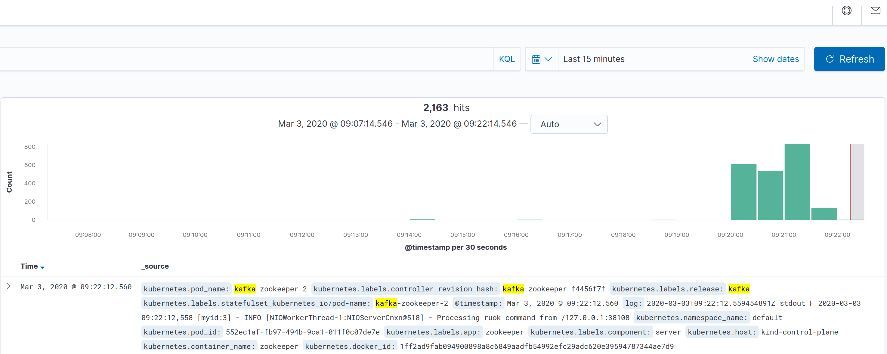

# kubernetes-observability-stack

Here is a [helmfile](https://github.com/roboll/helmfile) recipe for creating a cluster with a basic level of observability.

Deploys the following into the cluster with auto wiring:
- Elasticsearch-operator
- Jaeger-operator
- Prometheus-operator
- Weavescope
- Gloo
- Fluent-bit
- Kibana
- Grafana




## Requirements

- Kind
- Kubectl
- Helm ^3.0.0
- Helmfile

## Install


```bash
make up
make deploy
```


## Delete cluster

```bash
make down
```


### Bonus

_Deploy a Jaeger operator for the local ES cluster_

```bash
kubectl apply -n monitoring -f - << EOF
apiVersion: jaegertracing.io/v1
kind: Jaeger
metadata:
  name: elasticsearch-operator
spec:
  strategy: production
  storage:
    type: elasticsearch
    options:
      es:
        server-urls: http://elasticsearch-client:9200
EOF
```
