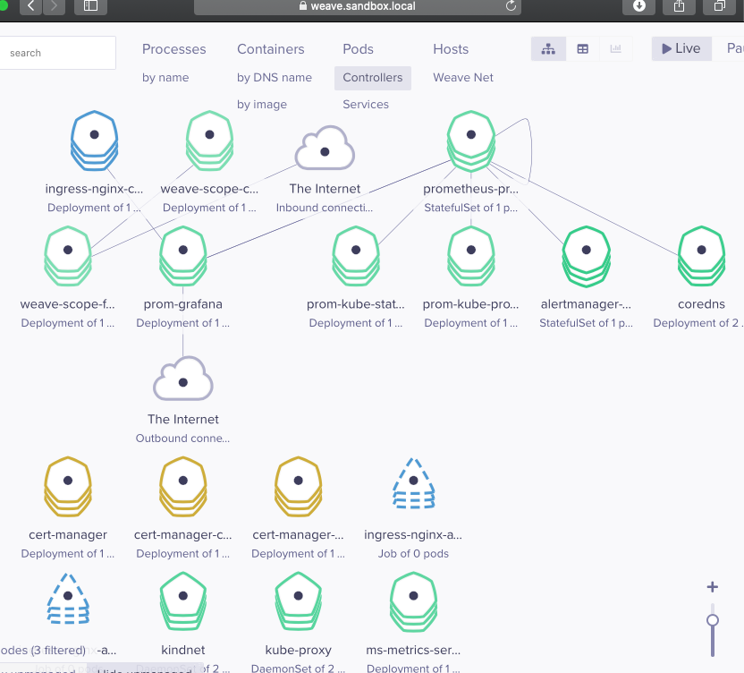
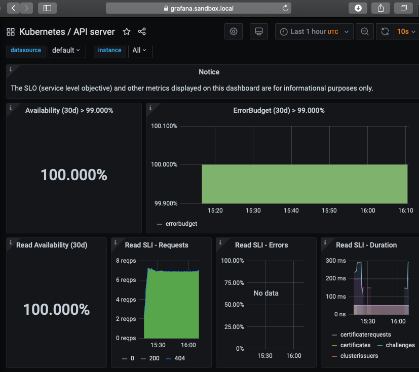
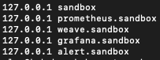
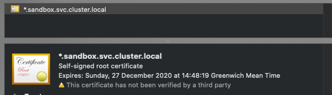
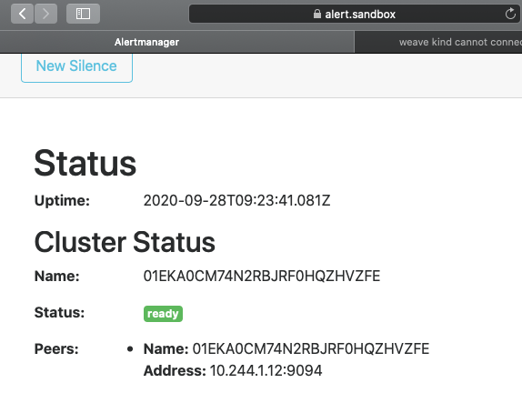

# kubernetes-observability-stack

This repository deploys some simple but useful observability systems into a cluster.
It uses helm3 for Kubernetes manifest package management and deploys a toy observability stack into KIND.


Deploys the following into the cluster with auto wiring:

- Metrics-server
- Prometheus-operator
- Weavescope
- Nginx Ingress
- Cert-manager
- Nginx

The observability all lives within `kube-system` and is accessible by an ingress route that maps to a dynamically created secret via cert manager.

<br />

<p align="left">

<br />
</p>

<br />

<p align="left">

<br />
</p>


## Requirements

- Kind
- Kubectl
- Helm ^3.0.0

## Install


```bash
make up
make install
```

### Using local ingress


Set these local `/etc/hosts` overrides...

<p align="left">

<br />
</p>

Now you'll be able to access the self-signed certificate for the cluster...
<p align="left">

<br />
</p>

`https://<service>.sandbox.local` will now work...

<p align="left">

<br />
</p>


## Delete cluster

```bash
make down
```
