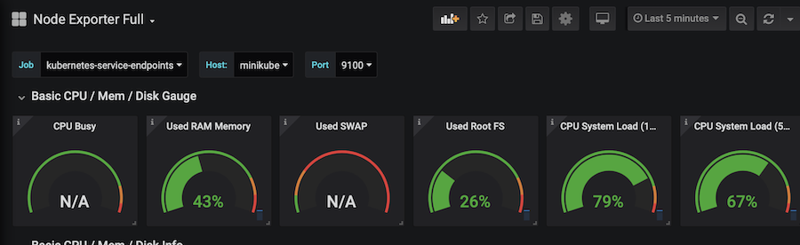
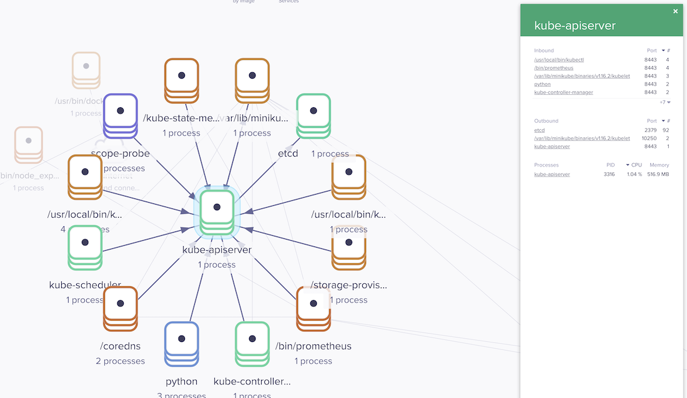

# kubernetes-cluster-helmfile

A basic cluster with observability using helmfile

Deploys the following into the cluster with auto wiring

```
➜  helmfiles git:(master) helm ls -n monitoring
NAME       	NAMESPACE 	REVISION	UPDATED                             	STATUS  	CHART            	APP VERSION
grafana    	monitoring	4       	2019-12-08 14:32:56.306551 +0000 UTC	deployed	grafana-4.1.3    	6.5.0
grafana-db 	monitoring	4       	2019-12-08 14:32:56.302927 +0000 UTC	deployed	mysql-1.6.0      	5.7.27
prometheus 	monitoring	4       	2019-12-08 14:32:53.547321 +0000 UTC	deployed	prometheus-9.5.1 	2.13.1
weave-scope	monitoring	1       	2019-12-08 14:33:00.957938 +0000 UTC	deployed	weave-scope-1.1.7	1.11.6
```






## Requirements

- Kubernetes cluster connected via Kubectl
- Helm ^3.0.0
- Helmfile

## Install

_Generate a grafana password_

```
kubectl create ns monitoring || true;

kubectl --namespace monitoring create secret generic grafana-secret \
--from-literal=admin-user=admin --from-literal=admin-password=admin
```


`helmfile sync`
